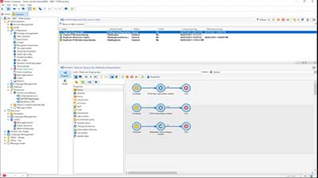

# Adobe Campaign V8-tutorials: overzicht

Adobe Campaign biedt een platform voor het ontwerpen van cross-channel klantervaringen en levert een omgeving voor visuele orkestratie van campagnes, realtime-interactiebeheer en uitvoering via meerdere kanalen. Deze gebruikershandleiding bevat video’s en tutorials over de vele functies en mogelijkheden van Adobe Campaign V8.

>[!INFO]
> Hebt u vragen? Wilt u uw ervaring delen of gedachten uitwisselen met uw collega&#39;s? Of hebt u feedback over de leercontent voor het Adobe-team? Neem deel aan het gesprek in de [Adobe Campaign Learning Community-discussie](https://experienceleaguecommunities.adobe.com:443/t5/adobe-campaign-classic/join-the-discussion-on-adobe-campaign-learning/td-p/419096)!

>[!NOTE]
> Campaign V8 is momenteel alleen beschikbaar als een Managed Cloud Service en kan niet worden geïmplementeerd in een on-premise of hybride omgeving. Geautomatiseerde migratie vanuit een bestaande Campaign Classic v7-omgeving is nog niet beschikbaar.
>
>Raadpleeg de [productdocumentatie](https://experienceleague.adobe.com/docs/campaign/campaign-v8/new/v7-to-v8.html?lang=nl) voor meer informatie over de overgang van Classic v7 naar V8.

## Nieuwe functies

* **[SMPP-protocol: meer details en probleemoplossing](https://experienceleague.adobe.com/docs/campaign-learn/set-up-sms-for-adobe-campaign/smpp-deep-dive-and-troubleshooting.html?lang=nl)**

   *Leer hoe SMPP-verbindingen tot stand worden gebracht en hoe SMPP gegevens uitwisselt via PDU&#39;s. Begrijp hoe u problemen met verbindingen kunt oplossen.*

* **[Configuratiescherm - Workflows controleren](https://experienceleague.adobe.com/docs/control-panel-learn/tutorials/performance-monitoring/monitor-workflows.html?lang=nl){target=&quot;_blank&quot;}**

   *Leer hoe u het tijdelijke opslaggebruik van uw workflows kunt controleren en waar u workflowinstellingen kunt configureren om database- of workflowproblemen voor uw instantie te voorkomen.*

* **[Configuratiescherm - Doorvoer en latentie bewaken](https://experienceleague.adobe.com/docs/control-panel-learn/tutorials/performance-monitoring/monitor-throughputs-and-latency.html?lang=nl){target=&quot;_blank&quot;}**

   *Leer leveringsdoorvoer en transactionele berichtlatentie van uw Campaign-instantie te controleren.*

## Aanbevolen door medewerkers van Adobe

<table>
<tr>
  <td>
    
    

      <a href="/help/get-started/create-a-marketing-plan-programs-and-campaigns.md">
    <strong>Een marketingplan maken</strong>
    </a>
    

    

    <em>Leer hoe u een marketingplan, -programma en -campagne maakt.</em>
    

  </td>
   <td>
    
    

      <a href="./content-creation/create-and-design-email-deliveries.md">
    <strong>E-mailleveringen maken en ontwerpen</strong>
    </a>
    

    

    <em>Het proces van het maken van een e-maillevering begrijpen en leren hoe u e-mailcontent kunt ontwerpen en personaliseren.
</em>
    

  </td>
  <td>
    
    

      <a href="./send-messages/fatigue-management/typology-rules-for-fatigue-management.md">
    <strong>Vermoeidheid beheren met behulp van typologische regels</strong>
    </a>
    

    

    <em>Leer hoe u vermoeidheidsbeheer in Adobe Campaign implementeert met behulp van typologische regels. </em>
    

  </td>
</tr>
<tr>
</td>
  <td>
    
    

      <a href="./reporting/generate-a-descriptive-analysis-report.md">
    <strong>Een beschrijvend analyserapport genereren</strong>
    </a>
    

    

    <em>Leer hoe u een beschrijvend analyserapport uit een workflow kunt genereren.</em>
    

  </td>
  <td>
   
     

      <a href="./data-management/data-management-fundamentals.md">
    <strong>Grondbeginselen van data management met workflows</strong>
    </a>
    

    

    <em>Leer wat targetingdimensies en werktabellen zijn en hoe Adobe Campaign gegevens beheert over verschillende databronnen.</em>
    

  </td>
  <td>
   
     

      <a href="./data-management/api-staging-mechanism.md">
    <strong>Mechanisme voor API-staging met FFDA</strong>
    </a>
    

    

    <em>Leer hoe het mechanisme voor API-staging werkt met volledige FDA.</em>
    

  </td>
</tr>
</table>

Zie de [productdocumentatie](https://experienceleague.adobe.com/docs/campaign-v8.html?lang=nl) voor meer informatie over deze functie.
